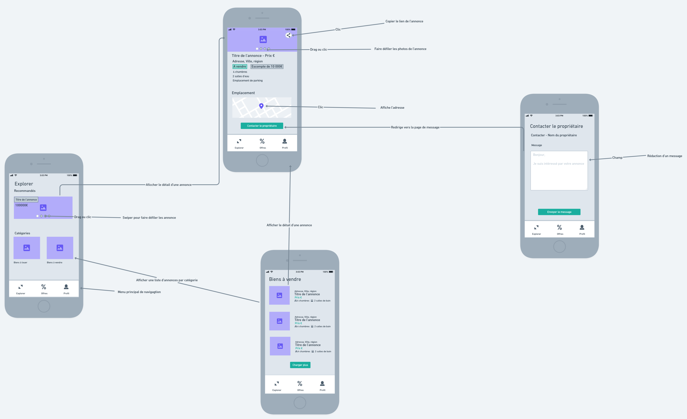
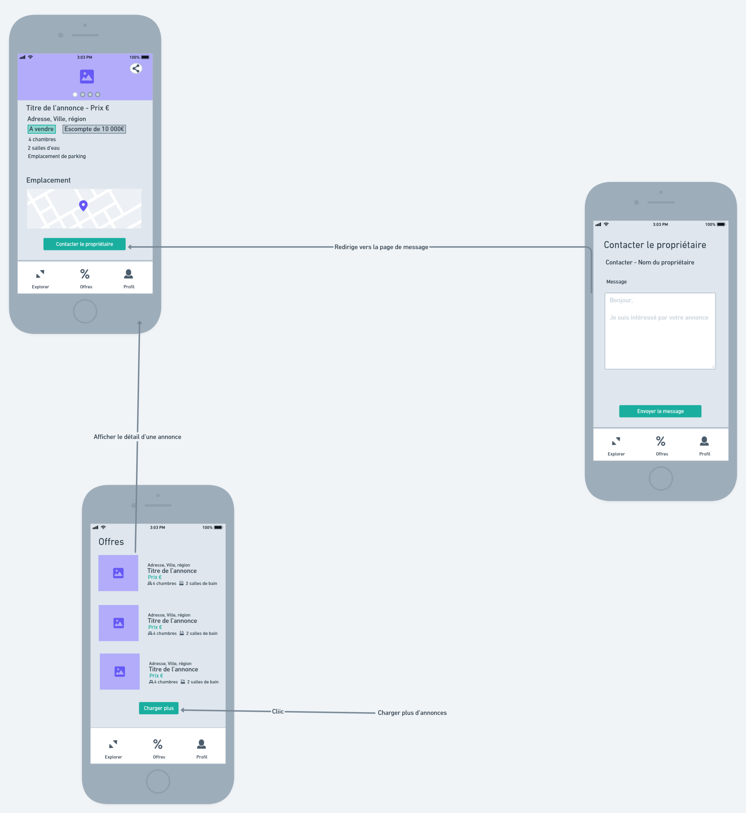
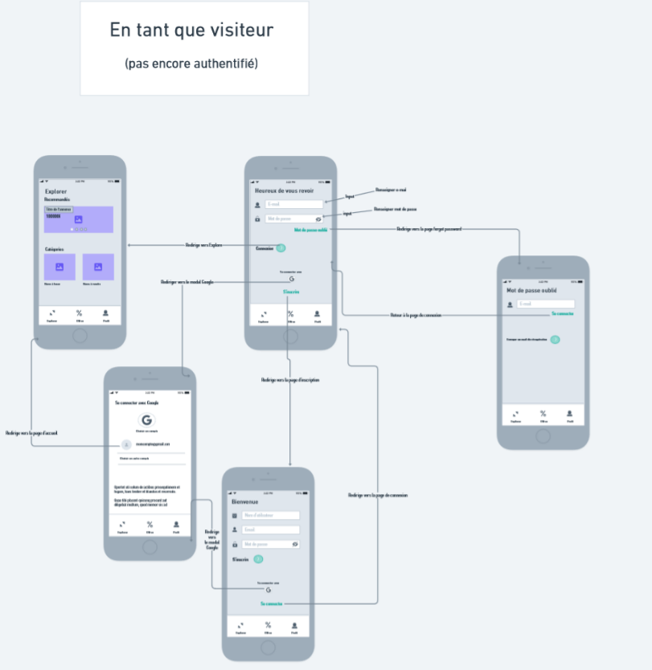
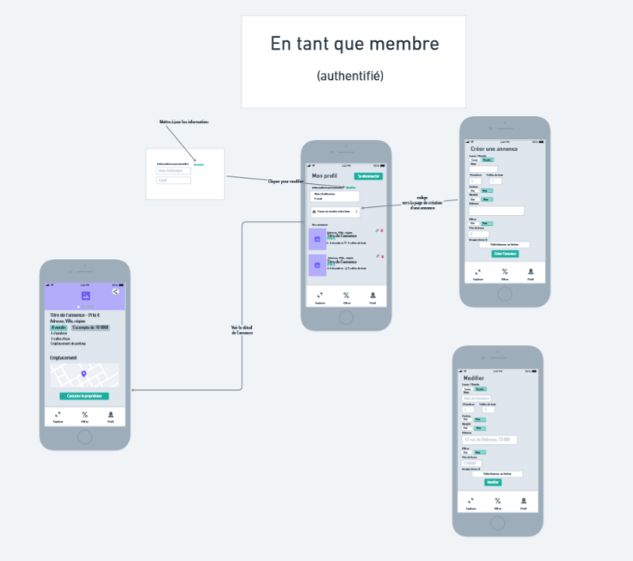

<h3 style="text-align:center; font-weight:bold;" align="center">Trouve la maison de tes rêves en quelques clics </h3>

 
 
<h2 style=" font-weight:bold">--- Qu'est-ce que c'est ? ---</h2>

Mon-chez-moi est une plateforme d'annonces immobilières  
Sans prise de tête, elle permet en un rien de temps de trouver les biens recherchés ou de poster ses propres annonces.

 
<h2 style=" font-weight:bold">--- Encore un site d'annonces ? ---</h2>

Au gré des avancées technologiques, les sites d'annonces en ligne se sont transformés progressivement pour répondre à des demandes toujours plus spécifiques. Ce gain de complexité, se traduit malheureusement souvent par une expérience utilisateur de plus en plus pénible qui tend à éloginer ses plateformes de leur but originel, à savoir la mise en relation des personnes intéressées. Pour répondre à ce besoin d'efficacité, il convient de revenir aux fondamentaux et de mettre la mise en relation des utilisateurs au coeur d'une application à la fois rapide, élégante et fonctionnelle. 

 
<h2 style=" font-weight:bold">--- Quels sont les objectifs ? ---</h2>

L'application se doit d'être la plus intuitive possible de manière à garantir un parcours sans encombre jusqu'à la prise de contact entre les utilisateurs. Pour cette raison, une importance toute particulière doit être accordée au design épuré de l'interface qui doit favoriser une navigation fluide aussi bien sur mobile que sur environnement de bureau.

 
<h2 style="font-weight:bold">--- Cahier des charges pour un MVP ---</h2>

- [1. Public ciblé](#target)
- [2. Fonctionnalités](#functionalities)
- [3. Technologies ](#technologies)
- [4. User stories](#stories)
- [5. Routes](#routes)
- [6. Maquettes fonctionnelles](#wireframes)

 

<a id="target"><h2 style=" font-weight:bold">--- Public ciblé ---</h2></a>
  

<a id="visitor" ><h4>1. Locataire / acheteur</h4></a>

Sans besoin d'être connecté, en tant que <b>visiteur</b> donc, le locataire / acheteur exercent deux rôles principaux :
- Un rôle consultatif, qui lui permet de prendre connaissance des différents annonces mises en lignes et d'en connaître les détails.
- Un rôle de mise en relation, qui lui permet d'envoyer un email au détenteur de l'annonce pour lui signaler son intérêt.

<a id="member"><h4>1. Loueur / vendeur</h4></a>

Possédant son compte utilisateur, en tant que <b>membre</b> donc, le loueur / vendeur approvisionne le site en annonces.
Il est en mesure de gérer lui-même le contenu en ajoutant des annonces qu'il pourra par la suite modifier ou supprimer.  

De toute évidence, le loueur / vendeur peut aussi utiliser l'application en tant que locataire / acheteur intéressé par une annonce qui n'est pas la sienne, cumulant ainsi les deux rôles.

<a id="functionalities"><h2 style=" font-weight:bold">--- Fonctionnalités ---</h2></a>

- [1. Explorer](#expolore)
- [2. Consulter ](#consult)
- [3. Contacter ](#contact)
- [4. S'authentifier ](#Profile)
- [5. Gérer ](#manage)

<a id="explore"><h4>1. Explorer</h4></a>
 
 - L'application doit recenser toutes les annones qui ont pu être ajoutées par les membres (loueurs / vendeurs).  
 - Pour faciliter cette exploration, l'application doit fournir différents moyens d'accéder rapidement aux ressources. Les annonces les plus récentes devront être mises en avant dès l'arrivée du visiteur (locataire / acheteur) sur la page d'accueil. 
 - Une recherche plus précise pourra être effectuée en fonction du type d'annonce (biens à louer / biens à vendre).
 -  Le visiteur aura également rapidement accès aux annonces bénéficiant d’une offre promotionnelle. 
 -  Les annonces les plus pertinentes devront être affichées en fonction de leur date d'ajout, les annonces moins récentes pourront être chargées si l'utilisateur le souhaite.

<a id="consult"><h4>2. Consulter</h4></a>

 - Le détail des annonces doit afficher les informations les plus pertinentes pour le visiteur.
 - Les photos qui mettent en valeur le bien consulté devront servir de vitrine pour l'annonce. 
 - Le bien devra pouvoir être identifiable par son titre accrocheur qui résume l'annonce.
 - Pour ne pas créer de confusions, les informations capitales relatives au prix et au type de bien devront être clairement affichée et mise en évidence par le design de l'application.
 - L'identification du bien passera également par la présence d'une carte qui permettra sa localisation.
 - L'annonce devra pouvoir être partagée facilement.

<a id="contact"><h4>3. Contacter </h4></a>

- A partir d'une annonce qui attire l'attention du visiteur, celui-ci doit pouvoir rapidement et simplement faire part de son intérêt auprès du membre qui a posté l'annonce.
- La prise de contact doit donc être possible sans avoir besoin de créer de compte utilisateur.
- Toujours en raccord avec l'approche direct de l'application, la communication s'effectue sans détour par le biais d'un e-mail envoyé au détenteur de l'annonce. 

<a id="profile" ><h4>4. S'authentifier </h4></a>
- L'inscription et la connexion s'effectueront d'une manière similaire en utilisant deux moyens: L'adresse e-mail pour son caractère non-discriminatoire, le compte google pour la commodité.
- Le profile sera minimaliste et ne comportera que les informations essentielles permettant d'identifier le membre. Ces informations pourront également être modifié simplement 
- En cas d'oubli du mot de passe, l'utilisateur pourra facilement le récupéer en renseignant son e-mail. 

<a id="manage" ><h4>5. Gérer </h4></a>
- Toutes les opérations de gestion des annonces pouvant être effectuées par un membre seront accessibles sur le page de profil. 
- L'ajout d'une annonce se fait par le biais d'un seul formulaire avec des paramètres par défauts. 
- Compte tenu du caractère essentiel des photos pour l'annonce, au moins une image devra pouvoir être téléchargée. Un maximum de 6 images par annonces sera exigé de manière à uniformiser les annonces sans surcharger le stockage d'images.
- Les annonces peuvent être modifiées et supprimées rapidement à partir d'une liste sur le profil. 

  
 
<a id="technologies"><h2 style="font-weight:bold">--- Technologies ---</h2></a>
 

Pour garantir une expérience utilisateur fluide, l'application sera monopage (SPA). Le design de l'application suivra l'approche mobile-first de manière à maintenir les mêmes repères visuels aussi bien sur l'affichage mobile que sur l'affiche de bureau. La partie backend reposera sur un service cloud (BaaS).

| Technologies |  Utilisation |
|--------------|--------------|
 | Pour créer la Single-Page-Application
 | Pour le routage 
 | Pour l'affichage des cartes permettant de localiser les annonces 
 | Pour faire défiler les photos des annonces 
|  | Pour afficher les alertes 
 | Pour l'authentification, la base de donnée et le stockage des images

 
<a id="stories"><h2 style="font-weight:bold">--- User Stories ---</h2></a>

1. Explorer  

| En tant que | Je veux Pouvoir | Dans le but de |
|------------|------------------|----------------|
|visiteur | naviguer sur le menu explorer | consulter les annonces |
|visiteur | swipper sur les photos des annonces | faire défiler les annonces recommandées |
|visiteur | cliquer sur une catégorie | afficher les biens à louer ou le bien à vendre |
|visiteur | cliquer sur la photo d'une annonce | afficher le détail d'une annonce |
|visiteur | cliquer sur le bouton "plus d'annonces" | afficher les annonces plus anciennes |
|visiteur | naviguer sur le menu offres | consulter les annonces bénéficiant d'une réduction |

2. Consulter 

| En tant que | Je veux Pouvoir | Dans le but de |
|------------|------------------|----------------|
|visiteur | swipper sur la bannière | voire les photos d'une annonce |
|visiteur | cliquer sur le bouton partager | copier le lien d'une annonce |
| visiteur | cliquer sur le marqueur de la carte | afficher l'adresse d'une annonce |

3. Contacter 

| En tant que | Je veux Pouvoir | Dans le but de |
|------------|------------------|----------------|
| visiteur | cliquer sur le bouton envoyer un message d'une annonce | pouvoir écrire un message |
| visiteur | écrier un message et cliquer sur le bouton envoyer | signaler mon intérêt auprès de l'auteur de l'annonce |

4. S'authentifier 

 | En tant que | Je veux Pouvoir | Dans le but de |
|------------|------------------|----------------|
|Visiteur   |   naviguer sur le menu profile | m'authentifier |
Visiteur | renseigner mon email ou utiliser google | m'inscrire |
Visiteur | renseigner mon email ou utiliser google | me connecter |
Visiteur | renseigner mon email | récupérer mon mot de passe |

5. Gérer 

 | En tant que | Je veux Pouvoir | Dans le but de |
|------------|------------------|----------------|
|Membre   |   naviguer sur le menu profile | gérer mon profil |
Membre | changer mes informations |   mettre à jour mon profil |
Membre | cliquer sur un bouton | ajouter une annonce |
Membre | sélectionner des images depuis mon ordinateur | ajouter des images à l'annonce |
| Membre | accéder à la liste de mes annonces | les modifier ou les supprimer |

 
<a id="stories"><h2 style="font-weight:bold">--- Routes ---</h2></a>

| Chemin | Composant |
|------|--------|
| / | <h4>Menu explorer</h4> |
| /category/:categoryName | Biens à louer ou bien à vendre |
| /category/:categoryName/:listingid | Détail d'une annonce |
| /contact/:landlOrdId | Formulaire de contact associé au propriétaire de l'annonce
| /offers | <h4>Menu Offres </h4> |
| /profile | <h4> Menu Profile</h4> |
| /sign-in | Formulaire de connexion |
| /sign-up | Formulaire d'inscription |
| /forgot-password | Formulaire de récupération du mont de passe |
| /create-listing | Formulaire d'ajout d'une annonce |
| /edit-listing/:listingId | Formulaire de modification d'une annonce |

 
<a id="wireframes"><h2 style="font-weight:bold">--- Maquettes fonctionnelles ---</h2></a>

<h3>1. Explorer  </h3>

<h3>2. Voir les offres  </h3>

<h3>3. S'authentifier  </h3>

<h3>4.  Gérer   </h3>

